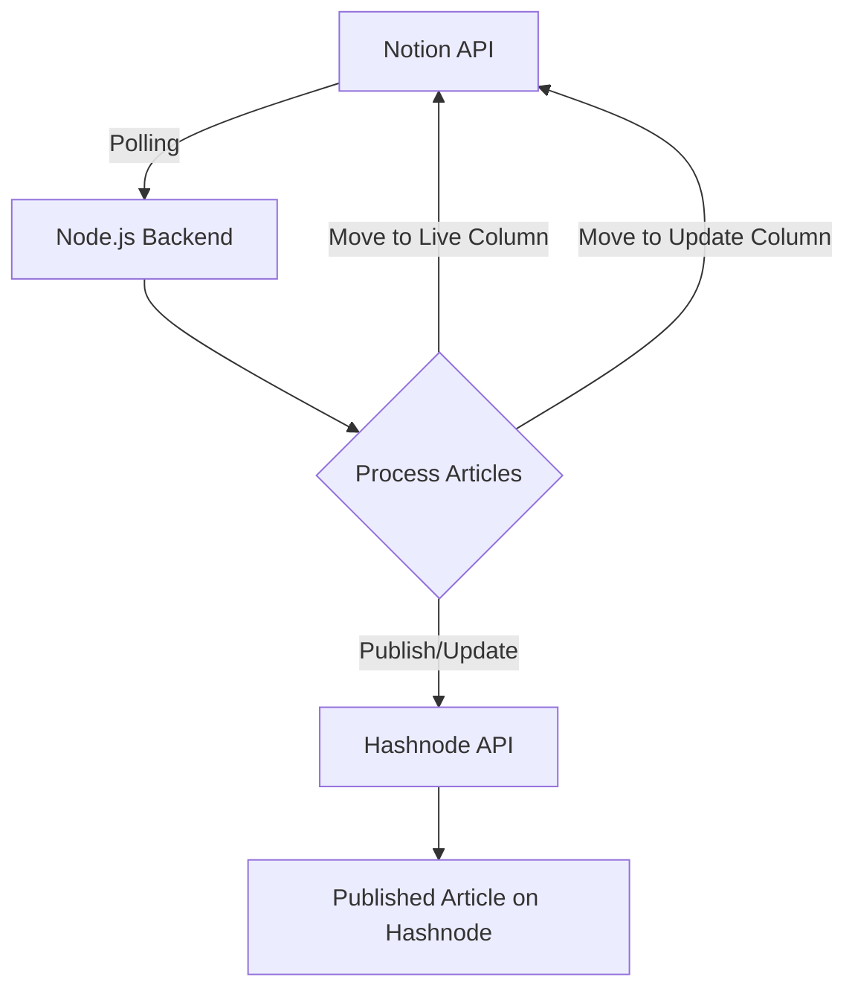

# Automated Publishing System: Notion to Hashnode Integration

## Overview

This project is a **Node.js** application designed to automate the publishing workflow between **Notion** and **Hashnode**. The application allows you to manage articles using a Notion Kanban board and automatically publish, update, or delete them on Hashnode by simply moving them between different columns.

### Key Features

- **Automated Publishing**: Write blog articles in Notion and seamlessly publish them on Hashnode.
- **Column-Based Workflow**: Move articles across Kanban columns such as "To Be Published", "Live", and "Revamped" to control their publishing status.
- **Error-Free Updates**: Once an article is live, any updates to it can be pushed to Hashnode by moving it to an "Update" column, ensuring the content is always up-to-date.
- **Optimized for Workflow Management**: Articles can be marked as "Trash" without being fully deleted, enabling soft deletion and re-publishing at a later date.

## Table of Contents

- [Automated Publishing System: Notion to Hashnode Integration](#automated-publishing-system-notion-to-hashnode-integration)
  - [Overview](#overview)
    - [Key Features](#key-features)
  - [Table of Contents](#table-of-contents)
  - [Architecture](#architecture)
    - [Key Components:](#key-components)
  - [Technologies Used](#technologies-used)
  - [Getting Started](#getting-started)
    - [Prerequisites](#prerequisites)
    - [Installation](#installation)
  - [Application Flow](#application-flow)
    - [Kanban Board Workflow](#kanban-board-workflow)
    - [Publishing Process](#publishing-process)
    - [Updating an Article](#updating-an-article)
    - [Soft Deletion](#soft-deletion)
  - [Database Design](#database-design)
  - [Error Handling](#error-handling)
  - [Rate Limits and Polling](#rate-limits-and-polling)
  - [Future Improvements](#future-improvements)
  - [Conclusion](#conclusion)

## Architecture

The application consists of a **Node.js** backend, using **Axios** to make HTTP requests to both Notion and Hashnode APIs.




### Key Components:

- **Notion API Integration**: Fetch articles, update their metadata, and manage column movements.
- **Hashnode API Integration**: Publish new articles, update existing ones, or delete them based on the current Notion column.
- **Redis Caching**: Caches article data to reduce the load on the Notion API.

## Technologies Used

- **Node.js**: The runtime used for the backend.
- **Axios**: Used to make API calls to Notion and Hashnode.
- **Postgres**: Used as a relational database for storing article metadata.
- **Upstash (Redis)**: Provides caching for API responses to handle rate limits efficiently.
- **Notion API**: To manage articles using a Kanban board.
- **Hashnode API**: To publish, update, and delete blog posts.

## Getting Started

### Prerequisites

1. **Node.js**: Make sure you have Node.js installed. You can download it from [here](https://nodejs.org/).
2. **Notion API Key**: Obtain your Notion API token from [Notion Developers](https://developers.notion.com/).
3. **Hashnode API Key**: Obtain your API token from [Hashnode API](https://hashnode.com/api).

### Installation

1. Clone the repository:

   ```bash
   git clone https://github.com/valentinesamuel/hashnode-heaven.git
   cd hashnode-heaven
   ```

2. Install dependencies:

   ```bash
   pnpm install
   ```

3. Configure environment variables:

   ```bash
   cp .env.example .env
   ```

4. Fill in your `.env` file with the following variables:

   - `NOTION_INTEGRATION_TOKEN`
   - `NOTION_DATABASE_ID` (your Notion database ID)
   - `HASHNODE_TOKEN`
   - `UPSTASH_REDIS_URL` (your Upstash Redis instance URL)
   - `POLLING_INTERVAL` (interval in milliseconds)
   - `DATABASE_URL` (path to your SQLite database)

5. Run the application:
   ```bash
   pnpm dev
   ```

## Application Flow

### Kanban Board Workflow

The Notion Kanban board is divided into several columns, each representing a stage in the article lifecycle:

1. **To-Do**: Articles that are in the drafting stage.
2. **In Progress**: Articles currently being written.
3. **To Be Published**: When articles are ready to go live, they are moved here.
4. **Published/Live**: Articles that are live on Hashnode are moved here once successfully published.
5. **Revamped**: Updated articles that need to be pushed live.
6. **Trash**: Soft-delete articles; they are removed from Hashnode but can be republished later.

### Publishing Process

- The backend continuously polls the Notion board.
- When an article is found in the "To Be Published" column, the application publishes the article on Hashnode.
- Once the article is published, the article metadata is updated on Notion with the `articleId` from Hashnode, and the page is moved to the "Published/Live" column.

### Updating an Article

- Moving an article to the "Revamped" column triggers an update process.
- The system updates the article on Hashnode using the stored `articleId` and moves the article back to the "Published/Live" column after a successful update.

### Soft Deletion

- Articles in the "Trash" column are not fully deleted from Hashnode. Instead, they are marked as "deleted" and can be republished later by moving them back to the appropriate column.

## Database Design

- **PostgreSQL** stores metadata for articles:

  - `articleId`: Unique ID of the article on Hashnode.
  - `notionPageId`: Unique ID of the Notion page.
  - `status`: Current status of the article (e.g., Published, Revamped, Deleted).

- **Redis (Upstash)** caches Notion API responses to minimize rate-limiting issues.

## Error Handling

- The application employs **try-catch** blocks to gracefully handle Notion and Hashnode API errors.
- In case of API rate limits or timeouts, a retry mechanism with exponential backoff is applied to avoid overwhelming the APIs.

## Rate Limits and Polling

- **Notion**: 3 requests per second.
- **Hashnode**: 2000 requests per minute.

The application respects these limits and dynamically adjusts the polling frequency to avoid API throttling.

## Future Improvements

- **Webhook Integration**: While Notion does not support webhooks, adding real-time updates via third-party services (e.g., Zapier) could reduce polling frequency.
- **More Extensive Error Handling**: Improve error recovery mechanisms, such as logging failed attempts and retries.
- **UI Integration**: Future versions could include a frontend to monitor article status or a dashboard to control the publication process.

## Conclusion

This project provides a seamless integration between Notion and Hashnode, automating the content publishing process and allowing for easy article management. With a robust Node.js backend and scalable architecture, this solution can easily be extended to multiple users or additional platforms.
